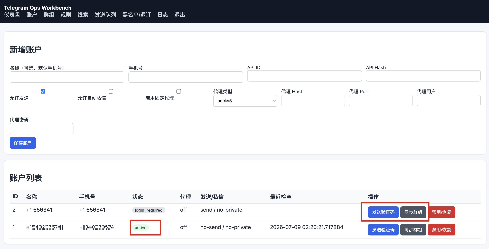
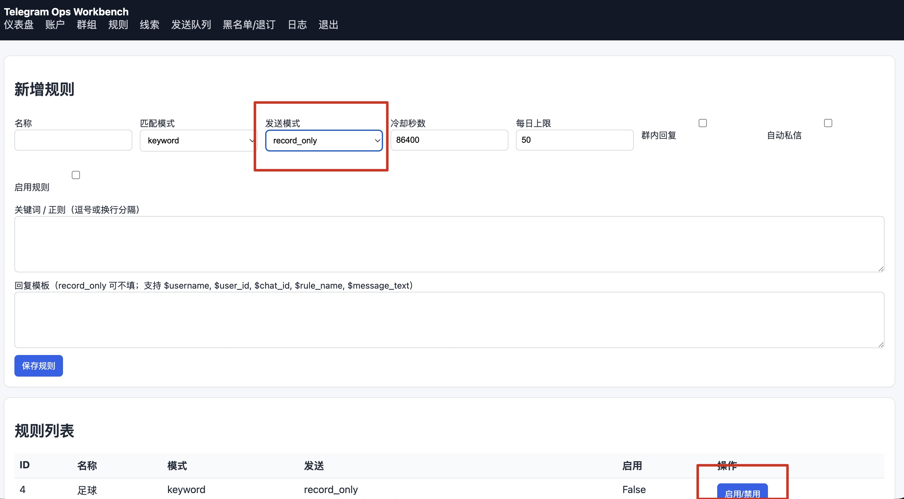
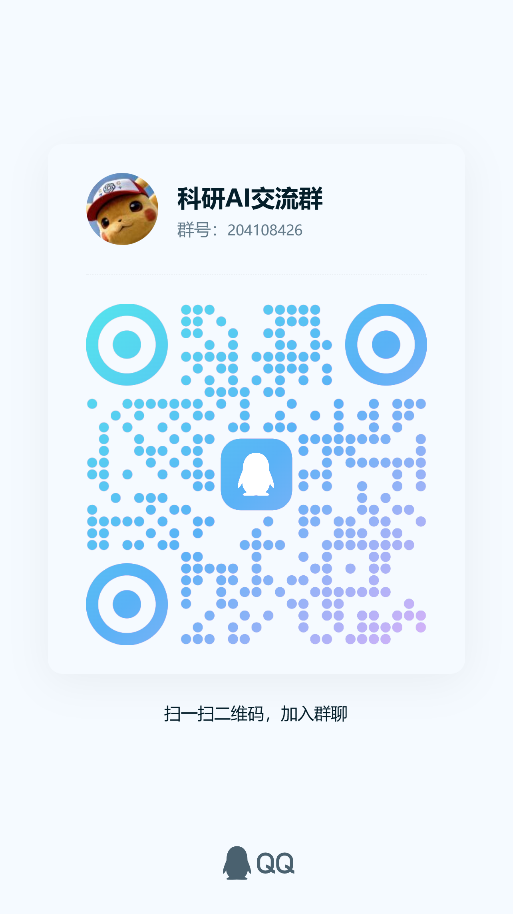

# telegram-AIops 🚀 (电报运维自动化工具)

`telegram-AIops` 是一个独立维护的 Telegram 多账号运维工作台，面向社群运营、消息监听、定时发布和 OSINT 信息归档场景。

项目基于 **FastAPI、Telethon (MTProto API)、SQLAlchemy 和 SQLite**，提供中文 Web 管理面板。账号、群组、规则、监听记录、发送队列和日志都可以在网页中集中管理。

---

## ✨ 核心功能

- 👥 **多账号管理**：网页添加、编辑和登录 Telegram 账号，支持 JSON 导入导出，便于迁移设备。
- 🌐 **账号级代理**：每个账号可独立配置 SOCKS5、SOCKS4 或 HTTP 代理，并支持用户名和密码。
- 🔍 **关键词与正则监听**：监听已同步的群组、频道和私聊，命中后生成结构化监听记录。
- 💬 **多种响应方式**：支持仅记录、群内回复、自动私信，以及群内回复并私信。
- ⏱️ **定时群发**：定时任务无需关键词；发送账号和目标群支持复选框多选，并按群组所属账号准确配对。
- 🎲 **随机发送间隔**：可配置最短和最长分钟数，每次在区间内随机安排下一次执行。
- 🧩 **回复模板**：回复内容可保存为命名模板，并支持 `$username`、`$user_id`、`$chat_id`、`$rule_name` 和 `$message_text` 变量。
- 📤 **发送队列与日志**：统一记录等待发送、发送中、已发送、失败、FloodWait 和暂停状态。
- 🛡️ **出站保护**：提供账号每日上限、用户每日上限、冷却时间、随机延迟、最小发送间隔和失败退避。
- 🖥️ **中文 WebUI**：导航栏显示 Worker 状态；规则、账号、队列、日志等时间统一显示为北京时间，内部仍使用 UTC 调度。

## 功能页面

| 页面 | 主要用途 |
| --- | --- |
| 仪表盘 | 查看账号、群组、规则和队列统计，启动或停止 Worker |
| 账户 | 管理 API 凭据、Session、代理、发送权限以及 JSON 导入导出 |
| 群组 | 同步账号已加入的群组并控制监听状态 |
| 规则 | 创建关键词、正则或定时任务，配置回复模板和发送目标 |
| 监听 | 查看关键词和正则命中的消息记录 |
| 发送队列 | 查看待发送、已发送、失败和暂停任务 |
| 黑名单/退订 | 管理拒绝接收的用户和关键词 |
| 日志 | 查看每次发送结果和错误原因 |

---

## 🛠️ 典型应用场景

1. **跨境私域引流**：监控同行公开群，一旦有用户发“怎么买”、“求推荐”，系统自动私信或群回复你的产品链接。
2. **安全情报分析 (OSINT)**：全量监听特定暗网或技术情报频道，命中“漏洞”、“0day”、“Leak”等词汇时自动归档并触发报警。
3. **社群高效客服**：多账号分工处理大型社群中的常见咨询，通过关键词触发记录、群内回复或私信流程。

---

## 🚀 生产环境快速部署 (强烈推荐 Docker)

为了避免本地 Python 环境冲突（如系统包污染等问题），我们推荐直接使用 **Docker 一键运行**。
1. 安装 Docker，可使用以下命令：
```bash
curl -fsSL https://get.docker.com | bash -s docker
```
2. 下载当前独立版本：
```bash
git clone https://github.com/775266553/telegram-ops-yunwei.git
cd telegram-ops-yunwei
```
3. 复制 `.env.example` 为 `.env`，设置 `APP_SECRET_KEY`、`ENCRYPTION_KEY` 和管理员密码。也可以生成密码哈希：
```bash
python3 ./telegram-ops/scripts/hash_password.py
```
按提示输入管理员密码，将生成的哈希填入 `ADMIN_PASSWORD_HASH`，并将 `ADMIN_PASSWORD` 置空。

4. 使用 `docker compose up -d` 启动，访问 `http://127.0.0.1:8000/admin/login`。

## 操作说明
1. 登录 Telegram 账户并加入需要监听的群组；部分群组需要人工完成验证。
2. 添加 Telegram 账号，填写手机号、API ID 和 API Hash，按需开启发送、自动私信和代理。
3. 账号状态为 `login_required` 时发送验证码，填写收到的验证码和两步验证密码（如有）。状态变为 `active` 后同步群组。
4. 在群组页面查看同步结果，通过“启用/禁用”控制是否监听。
5. 在规则页面新增规则，匹配模式可选“关键词”“正则表达式”或“定时任务”；发送模式可选“仅记录”“群内回复”“自动私信”“群内回复并私信”或“定时群发”。
6. 定时任务需要选择发送账号、目标群和发送内容，并填写最短/最长间隔。规则到期后只有 Worker 运行时才会进入发送队列。

## 本地保守启动

1. 复制 `telegram-ops/.env.example` 为 `telegram-ops/.env`，生成新的 `APP_SECRET_KEY`、`ENCRYPTION_KEY` 和 `ADMIN_PASSWORD_HASH`。
2. 首次启动保持 `AUTO_START_TELEGRAM_WORKERS=false`，先登录 WebUI 并仅添加一个测试账号。
3. 规则先使用 `record_only`，确认监听记录和去重符合预期后，再在自有测试群启用发送。
4. 使用 `docker compose up -d` 启动，访问 `http://127.0.0.1:8000/admin/login`。
5. 用 `docker compose logs -f telegram-app` 查看运行日志，用 `docker compose ps` 查看健康状态。

Windows 本地运行：

```powershell
cd telegram-ops
python run_server.py
```

启动入口会自动切换到兼容 Telethon 代理的事件循环。

## WebUI 使用补充

- 规则页使用中文匹配模式和发送模式；发送模式会自动决定群内回复和自动私信能力。
- 定时任务无需关键词。账号和目标群都可直接勾选一个或多个；先选择目标群时，页面会自动勾选所属账号。
- 定时任务支持固定周期或随机区间，例如 `120`～`135` 分钟。相同数值表示固定周期。
- Worker 停止时，规则页会提示定时任务不会进入发送队列；启动后，到期任务会依次进入队列并写入发送日志。
- 数据库使用 UTC 保存和调度时间，网页统一转换为北京时间显示，部署到不同时区的服务器也不会改变执行逻辑。
- 回复内容可以保存为命名模板，在新增或编辑规则时直接套用。
- 账户页支持 JSON 导入和导出；相同手机号导入时覆盖现有配置并重载 Worker。
- 导出文件包含 API 凭据、登录 Session 和代理密码，只用于受控设备间迁移，使用完成后及时移除。
- WebUI 使用服务端模板和少量原生 JavaScript，不需要 Node.js 或独立前端服务。

出站保护参数：

| 参数 | 默认值 | 作用 |
| --- | ---: | --- |
| `DEFAULT_ACCOUNT_DAILY_LIMIT` | 20 | 单账号每日排队上限 |
| `DEFAULT_USER_DAILY_LIMIT` | 1 | 单用户每日触达上限 |
| `OUTBOUND_DELAY_MIN_SECONDS` | 20 | 命中后最短排队延迟 |
| `OUTBOUND_DELAY_MAX_SECONDS` | 90 | 命中后最长排队延迟 |
| `OUTBOUND_MIN_INTERVAL_SECONDS` | 45 | 同账号两次成功发送的最小间隔 |
| `OUTBOUND_MAX_ATTEMPTS` | 3 | 自动尝试上限，超限后暂停并等待人工检查 |
| `OUTBOUND_RETRY_BASE_SECONDS` | 60 | 普通失败的指数退避基数 |
| `OUTBOUND_RETRY_MAX_SECONDS` | 1800 | 普通失败的最长退避时间 |

收到 Telegram `FloodWait` 时，该账号的待发送任务会整体暂停；只有该账号等待时间到期后才恢复。不要用自动重试绕过 Telegram 返回的限制。


## 安全措施
- 后台账号密码认证。
- `ADMIN_ALLOWED_IPS` 只允许指定公网 IP 访问。
- `ADMIN_COOKIE_SECURE=false`，保证 HTTP 下登录 Cookie 可用。
- 防火墙只开放 SSH 和应用端口。

## 注意

- 不用 HTTPS 时，登录密码和 Cookie 不加密传输；IP 白名单用于减少暴露面。
- 如果你的公网 IP 变化，会被系统拦截，需要 SSH 登录服务器修改 `.env` 后重启。
- 不要开放不需要的端口。

## 联系交流

QQ 群：**204108426**

欢迎交流部署、使用和功能建议。扫描下方二维码加入“科研 AI 交流群”：

<p align="center">
  
</p>

## 免责声明
本工具仅用于合规的社群运维、DevOps 自动化监控及网络安全学术研究。请严格遵守 Telegram 服务条款。因违反相关法律法规或滥用导致账号被封禁、引发法律纠纷的，责任由使用者自行承担。
